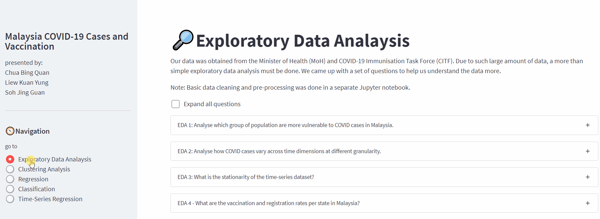

# Malaysia COVID-19 Cases and Vaccination

An in-depth extension of our previous [Assignment](https://github.com/BingQuanChua/COVID-19-Msia-Mining).

## 📚Datasets	

Data taken as of **`6-10-2021`** (cut off date)

Data source:

1. COVID-19 Open Data from the Minister of Health (MoH)  
   <a href='https://github.com/MoH-Malaysia/covid19-public' target="_blank">https://github.com/MoH-Malaysia/covid19-public</a>

2. Vaccination Data from COVID-19 Immunisation Task Force (CITF)  
   <a href='https://github.com/CITF-Malaysia/citf-public' target="_blank">https://github.com/CITF-Malaysia/citf-public</a>

## 📖Table of Contents

A list of questions that we have came up with.

### **Exploratory Data Analysis**

* Analyse which group of population are more vulnerable to COVID cases in Malaysia.
* Analyse how COVID cases vary across time dimensions at different granularity.
* What is the stationarity of the time-series dataset?
* What are the vaccination and registration rates per state in Malaysia?
* What are the types and total number of side effects for each type of vaccine?
* Which type of vaccine is given to more people?
* Which states are recovering? Which of the states shows a decrease in the number of COVID-19 cases?
* When is the time of the day with most MySejahtera check-ins?
* What are the dates with the highest number of checkins? How does it correlate with the number of cases and deaths during the day?
* Rate of Serious Vaccine Side Effect VS COVID Death Rate without obtaining vaccine, which one is more dangerous?

### **Clustering Analysis**  

* How well does each state handle COVID-19 cases based on past COVID-19 cases and deaths records?

### **Regression and Classification** 

* By utilizing the previous COVID-19 records, is it possible to construct a model capable of predicting/classifying the number of cases for the upcoming day or week?

### **Time-series Regression**

* Is it possible for the government to predict the number of daily new cases accurately based on past data in order to deploy appropriate movement control measures?

## 🐱‍💻Deployment

Our results are deployed on Heroku in the form of a Streamlit webapp.

Check out our project on <a href="https://covid-19-msia-cases-and-vax.herokuapp.com/" target="_blank"> Heroku </a>!

Screenshots:

 Navigate across findings easily 

 Clustering Analysis 

## 📑References

1. [COVID-19: What Is Hidden Behind the Official Numbers?](https://towardsdatascience.com/which-countries-are-affected-the-most-by-covid-19-4d4570852e31)
2. [How to Develop LSTM Models for Time Series Forecasting](https://machinelearningmastery.com/how-to-develop-lstm-models-for-time-series-forecasting/)
3. [Time Series Prediction with LSTM Recurrent Neural Networks in Python with Keras](https://machinelearningmastery.com/time-series-prediction-lstm-recurrent-neural-networks-python-keras/)
4. [Evaluate the Performance Of Deep Learning Models in Keras](https://machinelearningmastery.com/evaluate-performance-deep-learning-models-keras/)
5. [Multivariate Time Series Forecasting with LSTMs in Keras](https://machinelearningmastery.com/multivariate-time-series-forecasting-lstms-keras/)
6. [Stationarity in Time Series Analysis Explained using Python](https://blog.quantinsti.com/stationarity/)
7. [Time Series Analysis using ARIMA and LSTM(in Python and Keras)](https://medium.com/analytics-vidhya/time-series-analysis-using-arima-and-lstm-in-python-and-keras-part1-f987e11f9f8c)   
